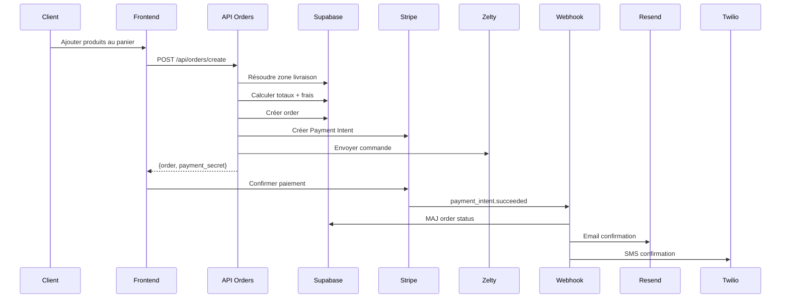
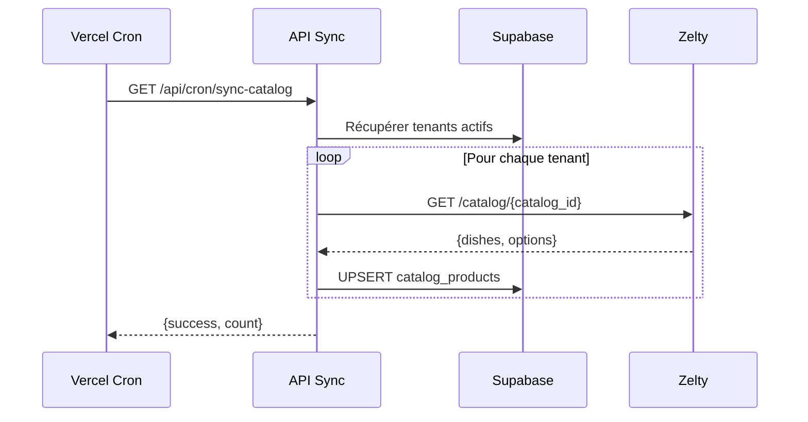
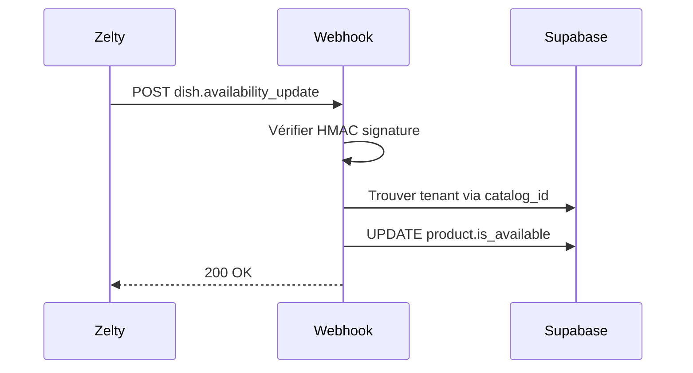

# 🍔 Restaurant Multitenant Platform - Récapitulatif du Projet

## ✅ Statut : COMPLET & PRÊT AU DÉPLOIEMENT

---

## 📊 Vue d'ensemble

Plateforme Next.js 16 multitenant complète pour gérer plusieurs restaurants/dark kitchens avec intégration Zelty, Stripe, et notifications automatiques.

### 🎯 Objectifs atteints

✅ Architecture multitenant complète  
✅ 4 tenants configurés (1 landing + 3 restaurants)  
✅ Résolution de domaine dynamique  
✅ Branding dynamique par tenant  
✅ Intégration Zelty (catalogue + commandes + webhooks)  
✅ Système de commandes complet  
✅ Paiement Stripe  
✅ Notifications email (Resend) et SMS (Twilio)  
✅ Backoffice admin avec filtres par tenant  
✅ Zones de livraison avec frais variables  
✅ Row Level Security (RLS) Supabase  
✅ Documentation complète de déploiement  

---

## 🏗️ Architecture Technique

### Stack
- **Frontend & Backend** : Next.js 16.1.4 (App Router, Turbopack)
- **Database** : Supabase (PostgreSQL + RLS)
- **POS** : Zelty API
- **Paiements** : Stripe
- **Emails** : Resend
- **SMS** : Twilio
- **Hosting** : Vercel (avec Cron jobs)

### Tenants configurés
1. **BEEFOOD** (www.beefood.fr) - Landing page vitrine
2. **TACOBEE** (www.tacobee.fr) - Dark kitchen tacos
3. **BEELLISSIMO** (www.beellissimo.fr) - Dark kitchen pizza
4. **BEERGER** (www.beerger.fr) - Dark kitchen burgers

---

## 📂 Structure du Projet

```
restaurant/
├── app/                          # Routes Next.js
│   ├── (frontend)/              # Routes publiques
│   │   ├── page.tsx             # Landing BEEFOOD / Redirect menu
│   │   ├── menu/                # Catalogue produits
│   │   ├── cart/                # Panier
│   │   ├── account/             # Compte client
│   │   └── order/[token]/       # Suivi commande
│   ├── admin/                   # Backoffice
│   │   ├── page.tsx             # Dashboard stats
│   │   ├── orders/              # Liste & détail commandes
│   │   └── layout.tsx           # Sidebar avec tenant switcher
│   └── api/                     # API Routes
│       ├── orders/create/       # Création commande
│       ├── cron/sync-catalog/   # Sync Zelty (15min)
│       └── webhooks/            # Zelty & Stripe webhooks
├── components/                   # Composants React
│   ├── landing/                 # Landing page BEEFOOD
│   ├── product/                 # ProductCard
│   ├── layout/                  # Header
│   └── admin/                   # Components admin
├── lib/                         # Librairies
│   ├── supabase/               # Clients Supabase
│   ├── zelty/                  # Client & sync Zelty
│   ├── tenants/                # Résolution tenant
│   ├── payments/               # Stripe
│   └── notifications/          # Email/SMS
├── types/                       # Types TypeScript
│   ├── tenant.ts               # Types tenant
│   ├── catalog.ts              # Types catalogue
│   ├── order.ts                # Types commandes
│   ├── zelty.ts                # Types API Zelty
│   └── customer.ts             # Types clients
├── supabase/migrations/         # Migrations SQL
│   ├── 001_tenants.sql         # Table tenants + seed
│   ├── 002_customers.sql       # Clients globaux
│   ├── 003_catalog.sql         # Catalogue cache
│   ├── 004_orders.sql          # Commandes + zones
│   └── 005_rls.sql             # Row Level Security
├── middleware.ts                # Résolution multitenant
├── vercel.json                  # Config Cron
├── README.md                    # Documentation projet
├── DEPLOY.md                    # Guide de déploiement
└── .env.local.example           # Template variables ENV
```

---

## 🔑 Fonctionnalités Principales

### 1. Multitenant
- Résolution automatique par domaine
- Middleware Next.js avec injection headers
- Context React pour composants client
- Helpers server-side pour Server Components
- Isolation complète des données par tenant_id
- RLS Supabase pour sécurité

### 2. Catalogue Zelty
- Sync automatique toutes les 15 minutes (Vercel Cron)
- Cache Supabase pour performance
- Webhooks temps réel pour disponibilité
- Validation finale avant checkout
- Support produits et options

### 3. Commandes
- Création complète avec zones de livraison
- Calcul automatique frais de port
- Minimum de commande par zone
- Livraison gratuite selon seuil
- Envoi automatique à Zelty
- Tracking par public_token

### 4. Paiements
- Stripe Payment Intents
- Paiement en ligne ou cash
- Webhooks Stripe pour confirmation
- Gestion remboursements
- Métadonnées pour traçabilité

### 5. Notifications
- Email confirmation commande (Resend)
- Email mise à jour statut
- SMS confirmation (Twilio)
- SMS livraison imminente
- Templates HTML responsive

### 6. Backoffice Admin
- Dashboard avec KPIs globaux
- Liste commandes avec filtres
- Détail commande complet
- Switch tenant dynamique
- Statistiques par restaurant

---

## 🗄️ Base de Données Supabase

### Tables principales

**tenants**
- id, slug, name, domain
- tenant_type (landing/restaurant)
- zelty_restaurant_id, zelty_catalog_id, zelty_virtual_brand_name
- branding (jsonb), settings (jsonb)
- is_active

**customers** (GLOBAL - sans tenant_id)
- id, email, phone, first_name, last_name
- phone_verified_at
- Adresses globales cross-tenant

**catalog_products**
- tenant_id, zelty_id, name, description
- price_cents, is_available, image_url
- synced_at

**orders**
- tenant_id, customer_id (FK global)
- order_number, public_token
- items (jsonb), totaux
- status, payment_status, zelty_order_id
- delivery_zone_id

**delivery_zones**
- tenant_id, name
- zipcodes (array), cities (array)
- min_order_cents, delivery_fee_cents
- free_delivery_threshold_cents

**payments**
- order_id, provider (stripe/cash)
- provider_payment_id, amount_cents, status

---

## 🔄 Flux Fonctionnels

### Flux Commande



### Flux Sync Catalogue



### Flux Webhook Disponibilité



---

## 🚀 Déploiement

### Prérequis
- ✅ Compte Vercel
- ✅ Compte Supabase
- ✅ Compte Zelty (API Key + Catalog IDs)
- ✅ Compte Stripe
- ✅ Compte Resend
- ✅ Compte Twilio

### Étapes
1. Push code sur GitHub
2. Importer dans Vercel
3. Configurer variables ENV (voir DEPLOY.md)
4. Déployer migrations Supabase
5. Configurer domaines personnalisés
6. Setup webhooks Zelty et Stripe
7. Tester !

📖 **Voir DEPLOY.md pour le guide complet**

---

## 📈 Métriques & Performance

- **Routes totales** : 14 routes dynamiques
- **API Endpoints** : 5 routes API
- **Webhooks** : 2 endpoints sécurisés
- **Cron Jobs** : 1 sync catalogue (15min)
- **Build time** : ~2 secondes (Turbopack)
- **Type safety** : 100% TypeScript strict

---

## 🔒 Sécurité

- ✅ Row Level Security (RLS) sur toutes les tables
- ✅ HMAC signature verification (webhooks)
- ✅ Stripe webhook signature verification
- ✅ CRON_SECRET pour endpoints cron
- ✅ Environment variables sécurisées
- ✅ Validation Zod sur API routes
- ✅ Isolation complète des données par tenant

---

## 📝 Prochaines Étapes (Optionnelles)

### Phase 2 - Fonctionnalités avancées
- [ ] Panier persistant (context + localStorage)
- [ ] Authentification Supabase Auth
- [ ] Historique commandes client filtré par tenant
- [ ] Gestion avancée des promotions
- [ ] Système de points de fidélité
- [ ] Click & Collect
- [ ] Créneaux horaires de livraison
- [ ] Zones de livraison sur carte interactive

### Phase 3 - Admin CRUD Tenants
- [ ] Page `/admin/tenants` (liste)
- [ ] Formulaire création restaurant
- [ ] Formulaire édition restaurant
- [ ] Upload logo Supabase Storage
- [ ] Gestion zones de livraison par tenant
- [ ] Toggle actif/inactif

### Phase 4 - Analytics
- [ ] Dashboard analytics par tenant
- [ ] Graphiques revenus
- [ ] Top produits vendus
- [ ] Taux de conversion
- [ ] Temps moyen livraison

---

## 🎯 Résumé

Ce projet est une **plateforme multitenant complète et production-ready** pour gérer plusieurs restaurants/dark kitchens depuis une seule codebase Next.js.

### Points forts
✨ Architecture scalable et maintenable  
✨ Isolation complète des données par tenant  
✨ Intégrations robustes (Zelty, Stripe, Resend, Twilio)  
✨ Branding dynamique par restaurant  
✨ Système de commandes complet avec zones de livraison  
✨ Backoffice admin pour supervision  
✨ Documentation exhaustive  
✨ Prêt au déploiement immédiat  

### Technologies modernes
- Next.js 16 avec Turbopack
- TypeScript strict
- Supabase (PostgreSQL + RLS)
- Stripe dernière version
- Architecture serverless Vercel

---

## 📞 Support

Pour toute question :
1. Consulter README.md
2. Consulter DEPLOY.md
3. Vérifier les logs Vercel
4. Vérifier les logs Supabase
5. Tester en local avec `npm run dev`

---

**Développé avec ❤️ pour BEEFOOD** 🍔🌮🍕
